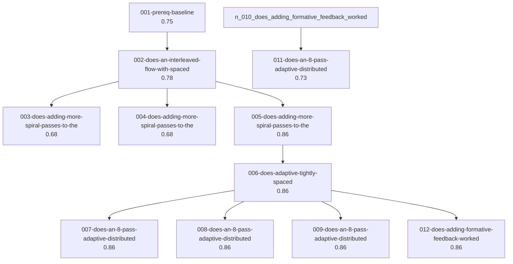

# Campaign

## Question

What tutoring flow best teaches the UK Year 6 to KS3 maths curriculum to a simulated learner cohort, maximizing mean mastery?

**Measuring:** mean_mastery_pct (target: 99)

## Experiments

| experiment | status | score | observed | parent |
|---|---|---|---|---|
| `005-does-adding-more-spiral-passes-to-the` | run | 0.86 | 83.55 | `002-does-an-interleaved-flow-with-spaced` |
| `006-does-adaptive-tightly-spaced` | run | 0.86 | 97.45 | `005-does-adding-more-spiral-passes-to-the` |
| `007-does-an-8-pass-adaptive-distributed` | run | 0.86 | 95.45 | `006-does-adaptive-tightly-spaced` |
| `008-does-an-8-pass-adaptive-distributed` | run | 0.86 | 95.45 | `006-does-adaptive-tightly-spaced` |
| `009-does-an-8-pass-adaptive-distributed` | run | 0.86 | 95.45 | `006-does-adaptive-tightly-spaced` |
| `012-does-adding-formative-feedback-worked` | run | 0.86 | 99.08 | `006-does-adaptive-tightly-spaced` |
| `002-does-an-interleaved-flow-with-spaced` | run | 0.78 | 79.99 | `001-prereq-baseline` |
| `001-prereq-baseline` | run | 0.75 | 11.71 | — |
| `011-does-an-8-pass-adaptive-distributed` | run | 0.73 | 95.45 | `010-does-adding-formative-feedback-worked` |
| `003-does-adding-more-spiral-passes-to-the` | run | 0.68 | 79.99 | `002-does-an-interleaved-flow-with-spaced` |
| `004-does-adding-more-spiral-passes-to-the` | run | 0.68 | 79.99 | `002-does-an-interleaved-flow-with-spaced` |

## Lineage

## Where this stands

Best so far: **`005-does-adding-more-spiral-passes-to-the`** at 0.86.
The target has been met.

25 recorded learning(s) — see `LEARNINGS.md`.

---

_Generated by `auto-adk campaign`._
